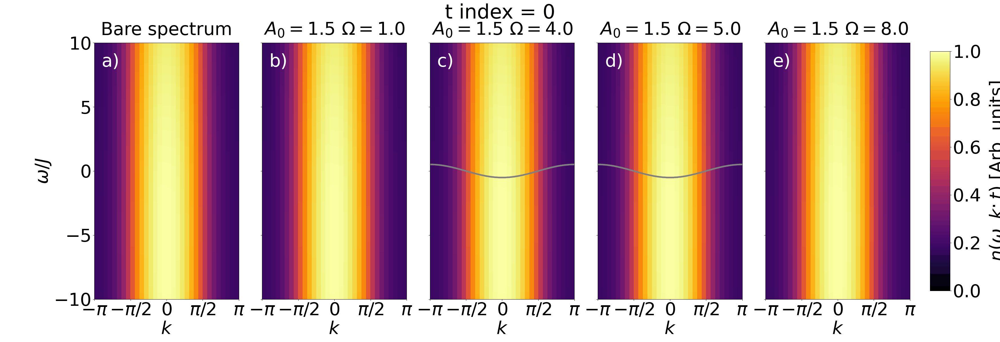

# Time and Momentum Resolved Tunneling Spectroscopy of Floquet Dynamics


Numerical implementation of a **time- and momentum-resolved tunneling spectroscopy protocol** that measures the quasi-instantaneous energy spectrum of periodically driven quantum systems, including the transient regime during the onset of the drive, without reconstructing the full time-dependent Green's function.

> **L. Q. Silveira and A. E. Feiguin**, *Time and Momentum Resolved Tunneling Spectroscopy of Floquet dynamics*, [arXiv:2608.26270](https://arxiv.org/abs/2608.26270) (2026).
> A copy of the manuscript is included in this repository: [Time and Momentum Resolved Tunneling Spectroscopy of Floquet dynamics.pdf](Time%20and%20Momentum%20Resolved%20Tunneling%20Spectroscopy%20of%20Floquet%20dynamics.pdf)



*Real-time evolution of the measured spectrum n(ω, k; t) for the driven spinless t–V chain, showing the build-up of an in-gap band at resonance.*

---

## Overview

Periodic driving is a powerful route to engineer effective Hamiltonians and stabilize states of matter with no equilibrium counterpart. Most treatments, however, rely on the high-frequency (Floquet–Magnus) limit and say nothing about the **transient regime** while the drive is turned on, precisely the regime that ultrafast experiments access.

Two obstacles make this regime hard to reach numerically:

1. Resolving the spectrum in time **and** momentum usually requires tracking the dynamics of all eigenstates, which is infeasible beyond small systems.
2. Away from equilibrium, the imaginary part of the retarded Green's function is not guaranteed to be positive, so the usual density-of-states interpretation breaks down.

This repository implements an alternative: an **extended tunneling spectroscopy** protocol in which a non-interacting probe wire is weakly coupled to the sample, and the spectrum is read off directly from the probe's momentum distribution. Each bias voltage is an independent simulation, so the full energy scan is *inherently parallel*, the method scales to large systems, and no knowledge of the instantenous eigenbasis is needed.

## The protocol

A one-dimensional sample under a time-periodic drive is coupled to an auxiliary non-interacting chain (the probe) held at bias voltage $V_g$:

$$H_{\text{probe}} = V_g \sum_{i=1}^{L} d_i^\dagger d_i, \qquad
H_{\text{tunnel}} = g(t) \sum_{i=1}^{L} \left( c_i^\dagger d_i + \text{h.c.} \right)$$

The tunneling amplitude follows a **Gaussian envelope**

$$g(t) = g_0 \exp\left[-\frac{(t - t_{\text{probe}})^2}{2\sigma^2}\right],$$

so tunneling events are localized in time around $t_{\text{probe}}$ and the spectrum is obtained *while the drive remains active*. Energy and momentum conservation constrain which processes can occur, and the spectrum is reconstructed from the probe occupation

$$n(k, V_g; t) = \sum_{j,j'} e^{ik(j - j')} \langle d_j^\dagger(t)\, d_{j'}(t) \rangle .$$

Scanning $V_g$ maps out the energy axis; shifting $t_{\text{probe}}$ maps out the time axis. Because $\sigma$ sets both the duration of the probing pulse and the energy resolution, the two cannot be determined simultaneously with infinite precision. This is a manisfestation of the *time-energy uncertantity principle* in the measured signal.

## Repository structure

```
.
├── Exact Diagonalization/
│   ├── Floquet bands.ipynb            # Floquet replicas, transient build-up (tight-binding / ionic)
│   ├── In-Gap formation.ipynb         # Gapped ionic model, two-site basis, inter-band excitations
│   └── Dynamical Localization.ipynb   # tanh-ramped drive tuned to the first zero of J_0
├── DMRG/
│   ├── spinless.py                    # Driven t–V chain (spinless fermions) + probe, TeNPy
│   ├── spinful.py                     # Driven Hubbard model (spinful) + probe, TeNPy
│   ├── submit-spinless.sh             # SLURM array job: parallel energy scan
│   ├── submit-spinful.sh              # SLURM array job: parallel energy scan
│   └── Plotting.ipynb                 # Loads results, builds n(ω,k;t) maps and animations
├── References/                        # Background literature (Floquet engineering, MPS/DMRG)
├── in-gap.gif                         # Animation of the in-gap band build-up
├── Time and Momentum ... Floquet dynamics.pdf
└── LICENSE.txt
```

## Models

| File | Sample Hamiltonian | Regime explored |
|---|---|---|
| `Floquet bands.ipynb` | Tight-binding chain, $\Delta = 0$ | Floquet replicas, sub-cycle transients, spectrum inversion at the pulse maximum |
| `In-Gap formation.ipynb` | Ionic chain, $H = -J\sum_j (e^{-iA(t)} c_j^\dagger c_{j+1} + \text{h.c.}) + \Delta \sum_j (-1)^j n_j$ | Long-lived excitations across the ionic gap; instantaneous bands $\epsilon^\pm(k,t) = \pm\sqrt{\Delta^2 + [2J\cos(k - A(t))]^2}$ |
| `Dynamical Localization.ipynb` | Tight-binding chain, hyperbolic ramp $A(t) = \tfrac{A_0}{2}[1 + \tanh((t-t_0)/\delta)]\sin(\Omega t)$ | Progressive flattening of the band into a dynamically localized steady state |
| `spinful.py` | Hubbard model, $U\sum_j (n_{j\uparrow} - \tfrac12)(n_{j\downarrow} - \tfrac12)$ | Spin–charge separation under driving; resonant $m\Omega = U\Delta_U$ transfer between Hubbard bands; driven spin exchange $J_S = 4J^2 \sum_m \lvert \mathcal{J}_m(A_0)\rvert^2 / (U - m\Omega)$ |
| `spinless.py` | $t$–$V$ chain, $V\sum_j (n_j - \tfrac12)(n_{j+1} - \tfrac12)$ | CDW order at half filling; **in-gap band** from resonant domain-wall creation, dispersing as $\epsilon_{\text{DW}}(k) = -2J\mathcal{J}_0(A_0)\cos k$ |

## Usage

### Notebooks

The ED notebooks are self-contained — open and run top to bottom. Each ends with an animation of $n(\omega, k; t)$ over the probing window.

### Cluster runs

`spinless.py` and `spinful.py` are driven from the command line; the energy scan is split across a SLURM job array, and each task further parallelizes over its slice with `joblib`.

```bash
# spinless: t–V chain
python spinless.py <task_id> <n_jobs> <omega_dir> <corr_dir> <L> <V> <A0> <Omega> <filling>

# spinful: Hubbard model
python spinful.py <task_id> <n_jobs> <omega_dir> <corr_dir> <L> <U> <V> <A0> <Omega> <filling>
```

| Argument | Meaning |
|---|---|
| `task_id`, `n_jobs` | 1-based index and total number of partitions of the $\omega$ array |
| `omega_dir`, `corr_dir` | Output directories for the bias slices and probe correlators |
| `L` | Sample length (probe has the same length) |
| `U`, `V` | On-site (spinful only) and nearest-neighbour interaction |
| `A0`, `Omega` | Drive amplitude and frequency, $A(t) = A_0 \sin(\Omega t)$ |
| `filling` | Sample filling; $0.5$ = half filling for spinless, $1.0$ = half filling for spinful |

Submit a full parameter sweep with:

```bash
sbatch DMRG/submit-spinless.sh
sbatch DMRG/submit-spinful.sh
```

Each script blocks the array into `(A0, Omega)` combinations, with `n_jobs` consecutive tasks covering the energy partitions of one combination. Edit `L`, `U0`/`V0`, `filling`, the `A0`/`omega` loops, the array size (`combos × n_jobs`) and the conda environment path at the bottom to match your setup.

### Post-processing

Results are written as

```
<results_dir>/omegas/omega_<i>.npy              # bias slice i
<results_dir>/correlations/correlation-low_<i>.npy   # (N_omega, N_t, L, L) probe correlator
```

`Plotting.ipynb` concatenates the slices, Fourier transforms the probe correlator into $n(\omega, k; t)$, applies light Gaussian smoothing, and produces the multi-panel spectra and animations. It expects the run directories grouped under two folders next to the notebook — `renormalization/` and `in-gap/` — with names of the form `results_L{L}_U{U}_A{A}_w{w}_n{n}` and `results_L{L}_V{V}_A{A}_w{w}_n{n}`, so rename/move the `results_id*` directory produced by SLURM accordingly.

## Requirements

```
python >= 3.9
numpy
scipy
matplotlib
joblib
physics-tenpy      # DMRG / TDVP
pillow             # writing GIF animations
```

The ED notebooks need only NumPy/SciPy/Matplotlib/joblib; TeNPy is required for the `DMRG/` scripts.

## Key results reproduced

- **Floquet replicas in real time**, including their transient build-up during state preparation, and the momentum-dependent bright/dark selection rule between successive replicas.
- **Bandwidth renormalization** and the crossover to a **dynamically localized** flat band under a slowly ramped drive.
- **Distinct response of charge and spin sectors** in the driven Hubbard model, with spectral weight transferred between the Hubbard bands once $\mathcal{J}_m(A_0)$ becomes comparable to $\mathcal{J}_0(A_0)$ at resonance.
- **Microscopic origin of the in-gap band** in the driven CDW insulator: resonant creation of *single* domain walls (cost $\sim V$, versus $\sim 2V$ in equilibrium), placing the in-gap dispersion at mid-gap.

The paper additionally reports a **finite-temperature** analog of the in-gap state (Fig. 7), where thermally excited domain walls produce a third spectral peak with weight controlled by the fugacity $z = e^{\beta V/2}$. That calculation uses imaginary-time tDMRG in the grand canonical ensemble and was carried out by A. E. Feiguin with a separate code, not included in this repository.

## References

The `References/` folder collects the background literature. The protocol presented here is primarily inspired by the extended tunneling spectroscopy of

- K. Zawadzki and A. E. Feiguin, *Time- and momentum-resolved tunneling spectroscopy of pump-driven nonthermal excitations in Mott insulators*, [Phys. Rev. B **100**, 195124 (2019)](https://doi.org/10.1103/PhysRevB.100.195124) — [arXiv:1905.08166](https://arxiv.org/abs/1905.08166)

to finite probing times. Other essential reading are: Rudner & Lindner, *The Floquet engineer's handbook* ([arXiv:2003.08252](https://arxiv.org/abs/2003.08252)); Bukov, D'Alessio & Polkovnikov, *Universal high-frequency behavior of periodically driven systems* ([Adv. Phys. **64**, 139 (2015)](https://doi.org/10.1080/00018732.2015.1055918)); Osterkorn *et al.* on in-gap band formation in driven CDW insulators ([arXiv:2205.09557](https://arxiv.org/abs/2205.09557)); and Hauschild *et al.*, *Tensor network Python (TeNPy)* ([SciPost Phys. Codebases 41 (2024)](https://doi.org/10.21468/SciPostPhysCodeb.41)).

## Citation

```bibtex
@article{Silveira2026FloquetSpectroscopy,
  title   = {Time and Momentum Resolved Tunneling Spectroscopy of Floquet dynamics},
  author  = {Silveira, Lucas Q. and Feiguin, Adrian E.},
  journal = {arXiv preprint arXiv:2608.26270},
  year    = {2026},
  eprint  = {2608.26270},
  archivePrefix = {arXiv},
  primaryClass  = {cond-mat.str-el}
}
```

## Acknowledgments

Computational resources provided by Northeastern University's Explorer Cluster at the Massachusetts Green High Performance Computing Center (MGHPCC). Supported by the U.S. Department of Energy, Office of Basic Energy Sciences, under Award Number DE-SC0022311.

## Contact

**Lucas Queiroz Silveira** — Physics Department, Northeastern University

- silveira.luc@northeastern.edu

## Note

This README.md was drafted with Claude Code using arXiv:2608.26270 as the source material. All content has been reviewed by the author for accuracy.

## License

MIT — see [LICENSE.txt](LICENSE.txt). The PDFs in `References/` are third-party publications included for convenience and remain under their original copyright.
